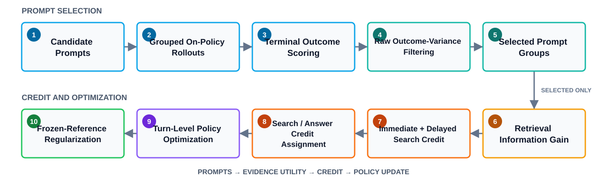

<div align="center">


# AetherSearch

**✨ A 3B multi-turn search agent trained with full-trajectory SFT, DPO, and information-gain-guided Agentic RL.**

[](https://huggingface.co/muradil211/AetherSearch)
[](https://huggingface.co/muradil211/AetherSearch-SFT)
[](https://huggingface.co/datasets/muradil211/AetherSearch_SFT)
[](https://huggingface.co/datasets/muradil211/AetherSearch-Eval)
[](https://github.com/Muradil-mamat-211/AetherSearch)
[](pyproject.toml)

🤗 [AetherSearch Model](https://huggingface.co/muradil211/AetherSearch) |
🤗 [AetherSearch SFT Model](https://huggingface.co/muradil211/AetherSearch-SFT) |
🤗 [AetherSearch SFT Data](https://huggingface.co/datasets/muradil211/AetherSearch_SFT) |
🤗 [Full Eval Data](https://huggingface.co/datasets/muradil211/AetherSearch-Eval)

</div>

## Open Resources

🔗 Models, datasets, and reproducibility inputs are linked directly below.

| Resource | Link | Contents |
|---|---|---|
| 🤗 Final model | [muradil211/AetherSearch](https://huggingface.co/muradil211/AetherSearch) | final model weights, tokenizer, config, and model card |
| 🤗 SFT checkpoint repository | [muradil211/AetherSearch-SFT](https://huggingface.co/muradil211/AetherSearch-SFT) | release target for the historical pre-SFT-2000 V3.1 Repair weights, tokenizer, integrity manifest, and qualified model card |
| 🤗 SFT-2000 data | [muradil211/AetherSearch_SFT](https://huggingface.co/datasets/muradil211/AetherSearch_SFT) | full JSONL payload, provenance manifest, checksums, and dataset card |
| 🤗 Search-R1 train data | [PeterJinGo/nq_hotpotqa_train](https://huggingface.co/datasets/PeterJinGo/nq_hotpotqa_train) | upstream `train.parquet`, pinned by checksum in `EXTERNAL_ASSETS.md` |
| 🤗 Full eval data | [muradil211/AetherSearch-Eval](https://huggingface.co/datasets/muradil211/AetherSearch-Eval) | complete 51,713-row Search-R1 `test.parquet`, provenance, and checksums |
| Retriever assets | [`EXTERNAL_ASSETS.md`](EXTERNAL_ASSETS.md#retriever-assets) | pinned upstream corpus, BM25, FAISS, and E5 revisions with checksums and download commands |
| Code | this repository | strict SFT-2000 trainer and build scripts, RL training code, configs, runtime assets, and tests |

## Table of Contents

- [Overview](#overview)
- [Highlights](#highlights)
- [Evaluation Results](#evaluation-results)
- [Quick Start](#quick-start)
- [Training Pipeline](#training-pipeline)
- [Method Overview](#method-overview)
- [Agentic RL Method](#agentic-rl-method)
- [Reproducibility & Configuration](#reproducibility-configuration)
- [Repository Layout](#repository-layout)
- [Release Scope](#release-scope)
- [Acknowledgements](#acknowledgements)
- [References](#references)
- [License](#license)

## Overview

AetherSearch is a 3B multi-turn search agent that operates against an external
retrieval environment. Given a question, the policy can issue multiple Search
actions, consume the returned evidence as environment context, and produce a
terminal Answer grounded in the accumulated trajectory.

The complete training lineage is full-trajectory supervised fine-tuning,
preference optimization, and Agentic RL. During RL, AetherSearch concentrates
updates on prompts with useful within-group outcome variation, measures how
retrieved evidence changes canonical-answer likelihood, and assigns both
immediate and delayed credit to Search actions.

The public release provides the strict SFT-2000 trainer, SFT assets and
metadata, a repository for the historical SFT checkpoint, the complete RL
training layer, a qualified reference recipe, and portable topology configuration. The
preference-optimization warm start is supplied as an external actor/reference
checkpoint; its trainer and preference-data generation pipeline are outside
the current release scope.

## Highlights

- Multi-turn retrieval with explicit Search and Answer actions.
- Raw outcome-variance filtering focuses updates on high-signal prompts.
- Retrieval utility is evaluated only after prompt filtering.
- Search actions receive both immediate and delayed retrieval-based credit.
- Turn-level on-policy optimization combines adaptive clipping with
  frozen-reference regularization.
- Algorithm configuration is decoupled from hardware topology.

## Evaluation Results

📊 Exact-match results across the released Search-R1 evaluation suites.

| Model | NQ | TriviaQA | PopQA | HotpotQA | 2WikiMultiHopQA | Musique | Bamboogle | Overall / Avg. EM |
|---|---:|---:|---:|---:|---:|---:|---:|---:|
| Search-R1 (Qwen2.5-3B Base, PPO) | **0.406** | 0.587 | **0.435** | 0.284 | 0.273 | 0.049 | 0.088 | 0.303 |
| Search-R1 (Qwen2.5-3B Instruct, PPO) | 0.341 | 0.545 | 0.378 | 0.324 | 0.319 | 0.103 | **0.264** | 0.325 |
| AetherSearch | 0.3977 | **0.5877** | 0.4229 | **0.3333** | **0.3985** | **0.1200** | 0.2320 | **0.3560** |

## Quick Start

🚀 The public entrypoint resolves one algorithm recipe, one asset manifest,
and one explicit hardware/qualification profile.

### Install

Install the local package inside an RL environment that already contains the
compatible PyTorch, veRL, vLLM, Ray, and FlashAttention stack:

```bash
python -m pip install -e .
```

### Configure local paths

Create the machine-local environment configuration:

```bash
cp environment/env.template.sh environment/env.local.sh
# Edit environment/env.local.sh, then:
source environment/env.local.sh
```

### Validate

Run the lightweight source, shell, and configuration checks, then resolve the
released hardware recipe without starting services:

```bash
bash scripts/validate_static.sh
bash scripts/train_rl.sh --dry-run
```

The default recipe is an **Official Qualified** reproduction. It enables
`configs/qualification/official_4x48gb_v1.yaml`, which checks the published
4x48GB/48-CPU/360-GiB host contract and public asset checksums. Portable
user-defined profiles use resource minimums and generic topology invariants
instead of claiming official qualification.

### Train

Start RL training on the validated four-GPU topology:

```bash
bash scripts/train_rl.sh
```

The included recipe assigns physical GPU 0 to retrieval and asynchronous
training-time evaluation, and physical GPUs 1-3 to the three-rank vLLM/FSDP2
runtime. Every 20-update evaluation uses the complete 51,713-row Search-R1
`test.parquet`. See `recipes/rl/README.md` for the configuration boundary.
The resolved configuration is materialized inside each new run directory.

## Training Pipeline

🧭 The complete training lineage is SFT → DPO → Agentic RL.

| Stage | Purpose | Primary locations |
|---|---|---|
| SFT | cold-start full-trajectory supervision | [SFT stage](sft/), [trainer](sft/scripts/train_sft_2000.py), [launcher](sft/scripts/run_train_sft_2000_zero3.sh), [checkpoint release repository](https://huggingface.co/muradil211/AetherSearch-SFT) |
| DPO warm start | externally produced actor/reference initialization | [AETHERSEARCH_ACTOR_MODEL](environment/env.template.sh), [AETHERSEARCH_REFERENCE_MODEL](environment/env.template.sh) |
| RL | search-augmented rollout and policy optimization | [src/agentic_rl/](src/agentic_rl/), [scripts/](scripts/), [recipes/rl/](recipes/rl/) |

RL starts from the DPO warm-start actor/reference checkpoint; it does not start
directly from the SFT stage.

## Method Overview

AetherSearch first identifies prompts with informative outcome variation, then
measures retrieval utility only for selected groups. Search actions receive
immediate and delayed information-based credit before turn-level optimization
under a frozen reference.

<div align="center">



</div>

## Agentic RL Method

> 🧠 **Method at a glance.** AetherSearch samples grouped on-policy
> trajectories, prioritizes prompts by raw terminal-outcome variance, scores
> the utility of retrieved evidence for selected groups, assigns multi-step
> Search and terminal Answer credit, and performs one turn-level policy update.

### 1. Rollout and terminal outcome

For each prompt $p$, the rollout policy samples a fixed group of trajectories:

```math
\left\{\tau_{p,i}\right\}_{i=1}^{G}.
```

A trajectory may contain several model-generated Search actions, their
retrieved environment observations, and one terminal Answer action:

```math
\tau_{p,i}
=
\left(
s_{p,i,1},o_{p,i,1},\ldots,
s_{p,i,T_i},o_{p,i,T_i},a_{p,i}
\right).
```

The public training path is:

```math
\boxed{
\text{on-policy rollout}
\rightarrow
\text{terminal outcome scoring}
\rightarrow
\text{high-signal prompt filtering}
\rightarrow
\text{selected-only retrieval scoring}
\rightarrow
\text{Search and Answer credit}
\rightarrow
\text{turn-level policy optimization}
\rightarrow
\text{reference regularization}
}
```

Terminal outcome and outcome eligibility are distinct. The eligible trajectory
set is:

```math
\mathcal E_p^O
=
\left\{
i:
\texttt{terminal\_answer\_valid}_{p,i}
\land
\texttt{trajectory\_system\_valid}_{p,i}
\right\}.
```

Only trajectories in $\mathcal E_p^O$ enter outcome statistics. For an
eligible trajectory, the task outcome is the best alias-aware token-level F1:

```math
\boxed{
O_{p,i}
=
\max_{a^\star\in\mathcal A_p}
\mathrm{TokenF1}
\left(
\hat a_{p,i},a^\star
\right).
}
```

If the terminal answer or trajectory system is invalid:

```math
O_{p,i}=0.
```

A numeric zero and an ineligible outcome are not equivalent. A valid answer
can receive F1 equal to zero and remain part of peer statistics, whereas an
ineligible trajectory is excluded. The production task reward is token F1,
not exact match.

### 2. High-signal prompt filtering

For each candidate prompt, only outcome-eligible trajectories contribute to
the score. Let $N_p=|\mathcal E_p^O|$. The within-prompt mean and sample
variance are:

```math
\bar O_p
=
\frac{1}{N_p}
\sum_{i\in\mathcal E_p^O}O_{p,i},
```

```math
\boxed{
V_p^O
=
\frac{1}{N_p-1}
\sum_{i\in\mathcal E_p^O}
\left(
O_{p,i}-\bar O_p
\right)^2.
}
```

This is sample variance with $\mathrm{ddof}=1$, not standard deviation or population
variance. The score is zero when fewer than two eligible outcomes are
available. Greater within-group dispersion indicates that the current policy
sometimes performs better and sometimes worse on the same prompt, providing a
stronger relative learning signal.

For intuition:

```text
Prompt A outcomes: [1, 1, 1, 1]  -> variance = 0
Prompt B outcomes: [0, 0, 0, 0]  -> variance = 0
Prompt C outcomes: [1, 0, 1, 0]  -> variance > 0
```

Prompt C is prioritized because its group contains distinguishable outcomes.
The example is binary only for clarity; the production outcome is continuous,
alias-aware token F1.

Prompts are ordered by descending raw variance:

```math
V_{\sigma(1)}^O
\ge
V_{\sigma(2)}^O
\ge
\cdots
\ge
V_{\sigma(P)}^O.
```

The selector retains the shortest prefix whose cumulative raw-variance mass
reaches $\rho$ of the total:

```math
\boxed{
K^\star
=
\min
\left\{
K:
\sum_{j=1}^{K}V_{\sigma(j)}^O
\ge
\rho\sum_pV_p^O
\right\},
\qquad
\rho=0.9.
}
```

```math
\mathcal P_{\mathrm{selected}}
=
\left\{
\sigma(1),\ldots,\sigma(K^\star)
\right\}.
```

The threshold covers 90% of total raw variance mass, not 90% of prompts.
Minimum and maximum prompt counts, refill rounds, and capacity truncation are
separate runtime policies. This filter uses raw terminal-outcome variance
only; retrieval scores and downstream credit signals do not enter prompt
selection. Retrieval utility is computed only for the retained groups.

### 3. Retrieval information gain

For each selected Search action, AetherSearch measures how the retrieved
observation changes the rollout-start policy snapshot's likelihood of a fixed
canonical answer. The canonical answer is the first ground-truth alias:

```text
canonical_answer = aliases[0]
```

The fixed teacher-forced target is:

```text
<think>The retrieved evidence now supports the answer.</think><answer>{canonical_answer}</answer>
```

The entire rendered target is tokenized once with special-token insertion
disabled and offset mapping enabled. Character offsets identify the
answer-covering token span $B_p$:

- the scaffold and the `<think>`, `<answer>`, and `</answer>` tags are
  teacher-forced context;
- only answer-body tokens contribute to the score;
- the scaffold and answer are not tokenized independently;
- answer token $j$ is scored from its preceding causal logit.

For a trajectory prefix $h$, define the mean answer-body log-probability:

```math
\Phi_p(h)
=
\frac{1}{|B_p|}
\sum_{j\in B_p}
\log
\pi_{\theta_{\mathrm{snap}}}
\left(
y_{p,j}\mid h,y_{p,1:j-1}
\right),
```

where $\theta_{\mathrm{snap}}$ is the rollout-start policy snapshot. For the
prefixes immediately before and after a retrieved observation:

```math
\boxed{
r^{IG}_{p,i,t}
=
\Phi_p\left(h^+_{p,i,t}\right)
-
\Phi_p\left(h^-_{p,i,t}\right).
}
```

The score is a difference of mean log-probabilities:

```math
r^{IG}
\ne
\exp\left(\Phi_{\mathrm{post}}\right)
-
\exp\left(\Phi_{\mathrm{pre}}\right).
```

There is no exponentiation. Scoring uses a detached, no-gradient FP32 forward
from the rollout-start snapshot with causal preceding-logit alignment. A
missing or invalid pre/post observation makes the Search action
retrieval-score-ineligible; no raw-score fallback is inserted.

### 4. Multi-step Search credit assignment

**Raw future return.** For trajectory $(p,i)$, let the valid Search positions
be:

```math
\mathcal V_{p,i}
=
\left\{
t:
r^{IG}_{p,i,t}
\text{ is valid}
\right\}.
```

The future retrieval return from Search depth $t$ is:

```math
G^{IG}_{p,i,t}
=
\sum_{\substack{k\ge t\\k\in\mathcal V_{p,i}}}
\gamma^{k-t}r^{IG}_{p,i,k}.
```

The training configuration fixes $\gamma=1$, giving:

```math
\boxed{
G^{IG}_{p,i,t}
=
\sum_{\substack{k\ge t\\k\in\mathcal V_{p,i}}}
r^{IG}_{p,i,k}.
}
```

The ordering is part of the method:

```text
raw retrieval gain
-> raw suffix return
-> independently normalize immediate and return signals
-> mix the normalized signals
```

Invalid positions are omitted from the suffix index set rather than replaced
with artificial zeros.

**Peer normalization.** Search actions are compared only among trajectories
with the same prompt and Search depth. For a valid immediate-gain peer set:

```math
\mathcal I_{p,t}
=
\left\{
i:
r^{IG}_{p,i,t}
\text{ is valid}
\right\},
\qquad
n_{p,t}=|\mathcal I_{p,t}|.
```

For either immediate gain or raw future return, population statistics are:

```math
\mu_{p,t}(x)
=
\frac{1}{n_{p,t}}
\sum_{i\in\mathcal I_{p,t}}x_i,
```

```math
\sigma_{p,t}(x)
=
\sqrt{
\frac{1}{n_{p,t}}
\sum_{i\in\mathcal I_{p,t}}
\left(
x_i-\mu_{p,t}(x)
\right)^2
}.
```

Normalization uses population standard deviation ($\mathrm{ddof}=0$):

```math
Z_{p,t}(x_i)
=
\frac{x_i-\mu_{p,t}(x)}
{\sigma_{p,t}(x)+\epsilon},
\qquad
\epsilon=10^{-6}.
```

If $\sigma_{p,t}^2\le10^{-12}$, that signal is exactly zero. Immediate and
future-return statistics are independent:

```math
A^{\mathrm{local}}_{p,i,t}
=
Z_{p,t}\left(r^{IG}_{p,i,t}\right),
```

```math
A^{\mathrm{return}}_{p,i,t}
=
Z_{p,t}\left(G^{IG}_{p,i,t}\right).
```

With at least two valid peers, Search credit is:

```math
\boxed{
A^{\mathrm{search}}_{p,i,t}
=
\frac12A^{\mathrm{return}}_{p,i,t}
+
\frac12A^{\mathrm{local}}_{p,i,t}.
}
```

A zero-variance signal remains a zero contribution; the other half is not
reweighted.

**Sparse-peer fallback.** Terminal outcomes are population-normalized within
each prompt:

```math
\mu_p^O
=
\frac{1}{N_p}
\sum_{i\in\mathcal E_p^O}O_{p,i},
```

```math
\sigma_p^O
=
\sqrt{
\frac{1}{N_p}
\sum_{i\in\mathcal E_p^O}
\left(
O_{p,i}-\mu_p^O
\right)^2
},
```

```math
Z^O_{p,i}
=
\frac{O_{p,i}-\mu_p^O}
{\sigma_p^O+\epsilon}.
```

If the outcome is ineligible or its variance is at most $10^{-12}$, then
$Z^O_{p,i}=0$. The complete Search-credit rule for policy-eligible actions is:

```math
\boxed{
A^{\mathrm{search}}_{p,i,t}
=
\begin{cases}
\frac12A^{\mathrm{return}}_{p,i,t}
+
\frac12A^{\mathrm{local}}_{p,i,t},
&
n_{p,t}\ge2,
\\[8pt]
Z^O_{p,i},
&
n_{p,t}=1,
\\[6pt]
0,
&
\text{retrieval score unavailable or invalid}.
\end{cases}
}
```

The single-peer fallback uses terminal outcome only and does not add format
credit. An unavailable score is a separate fail-closed case. Search actions
that are ineligible for policy credit are excluded from actor optimization.

### 5. Answer credit and token masking

Let the terminal format indicator be $F_{p,i}\in\{0,1\}$. Format credit is
centered within the rollout group but is not divided by a standard deviation:

```math
A^{\mathrm{format}}_{p,i}
=
F_{p,i}
-
\frac1G\sum_{j=1}^{G}F_{p,j}.
```

Terminal Answer credit is:

```math
\boxed{
A^{\mathrm{answer}}_{p,i}
=
\lambda_OZ^O_{p,i}
+
\lambda_FA^{\mathrm{format}}_{p,i},
\qquad
\lambda_O=\lambda_F=1.
}
```

Retrieval gain is not routed into terminal Answer credit.

Credit is expanded only to real model-generated policy spans:

```math
\text{Search action tokens}
\mapsto
A^{\mathrm{search}}_{p,i,t},
\qquad
\text{terminal Answer tokens}
\mapsto
A^{\mathrm{answer}}_{p,i}.
```

Retrieved observations such as `<information>...</information>` are
environment context, not actor actions:

```math
\boxed{
m^{\mathrm{policy}}_j=0
\quad
\text{for environment-observation tokens}.
}
```

System, user, prompt, padding, and non-model fallback tokens are also masked
out. They provide context to the policy but receive no actor credit.

### 6. Turn-level policy optimization

**Turn-level ratio.** For an eligible turn $t$, let $\mathcal A_t$ be its
model-generated action-token set. Current-policy log-probabilities retain
gradients and old-policy log-probabilities are detached:

```math
\Delta_t
=
\frac{1}{|\mathcal A_t|}
\sum_{j\in\mathcal A_t}
\left[
\log\pi_\theta(x_j\mid x_{1:j-1})
-
\log\pi_{\mathrm{old}}(x_j\mid x_{1:j-1})
\right].
```

The importance ratio is:

```math
\boxed{
\rho_t=\exp(\Delta_t).
}
```

This is the geometric mean of token likelihood ratios across the turn, not a
set of independently clipped token-level ratios. The training setup uses
one strict on-policy update:

```text
strict_on_policy = true
ratio_level = turn
ppo_epochs = 1
optimizer_mini_steps = 1
optimizer_steps_per_successful_update = 1
```

**Information-aware turn clipping.** Search turns use the normalized
immediate retrieval gain, $\widehat r_t^{IG}$, to set their clipping scale:

```math
c_t
=
1+
\beta_c
\left(
2\sigma\left(\widehat r_t^{IG}\right)-1
\right),
\qquad
\sigma(x)=\frac{1}{1+e^{-x}}.
```

The fixed values and bounds are:

```math
\beta_c=0.3,
\qquad
\epsilon_{\mathrm{low}}=0.003,
\qquad
\epsilon_{\mathrm{high}}=0.004,
```

```math
l_t = 1-c_t\epsilon_{\mathrm{low}},
\qquad u_t = 1+c_t\epsilon_{\mathrm{high}}.
```

For turn advantage $A_t$, the clipped surrogate is:

```math
J_t
=
\min
\left[
\rho_tA_t,
\mathrm{clip}
\left(
\rho_t,l_t,u_t
\right)A_t
\right].
```

The clipping input is the normalized immediate signal
$A^{\mathrm{local}}$, not the mixed $A^{\mathrm{search}}$. Single-peer and
missing-score Search turns use neutral zero as the clipping input. Answer
turns use the neutral scale $c_t=1$.

**Reference regularization.** A frozen reference model is kept in evaluation
mode with no trainable parameters. At each eligible token's preceding causal
state, AetherSearch computes full-vocabulary forward KL:

```math
D_{\mathrm{KL}}
\left(
\pi_\theta(\cdot\mid s_j)
\;\middle\|\;
\pi_{\mathrm{ref}}(\cdot\mid s_j)
\right)
=
\sum_v
\pi_\theta(v\mid s_j)
\log
\frac{\pi_\theta(v\mid s_j)}
{\pi_{\mathrm{ref}}(v\mid s_j)}.
```

This is not a sampled-token log-ratio proxy. Reference logits are detached;
the vocabulary sum may be chunked for memory without changing the
mathematical result. The combined loss is:

```math
\boxed{
\mathcal L
=
-J_{\mathrm{task}}
+
\beta_{\mathrm{KL}}\mathcal L_{\mathrm{KL}},
\qquad
\beta_{\mathrm{KL}}=0.01.
}
```

**Balanced reduction.** Eligible action-token values are first averaged
within each trajectory:

```math
J_{p,i}
=
\frac{1}{|\mathcal A_{p,i}|}
\sum_{j\in\mathcal A_{p,i}}J_{p,i,j}.
```

Trajectory means are then averaged within each prompt:

```math
J_p
=
\frac1G
\sum_{i=1}^{G}J_{p,i}.
```

Finally, prompt means are averaged globally:

```math
J_{\mathrm{task}}
=
\frac{1}{|\mathcal P|}
\sum_{p\in\mathcal P}J_p.
```

The same token → trajectory → prompt balancing is applied to KL. This avoids
giving longer trajectories more weight solely because they contain more
eligible action tokens.

### 7. Compact algorithm

```text
Input:
    candidate prompts
    G on-policy trajectories per prompt

1. Score terminal answers with alias-aware token F1.

2. Compute within-prompt outcome sample variance.
   Rank prompts by raw variance and retain the shortest prefix
   carrying at least 90% of total raw variance mass.

3. For retained prompts only, measure the canonical-answer
   log-likelihood change produced by each retrieval.

4. Sum future raw retrieval gains from every valid Search turn.

5. Normalize immediate and delayed-return signals among
   trajectories sharing the same prompt and Search depth.

6. Assign Search credit:
       >= 2 peers: 0.5 * delayed + 0.5 * immediate
       1 peer: normalized terminal outcome
       unavailable retrieval score: 0

7. Assign terminal Answer credit from normalized task outcome
   plus centered format correctness.

8. Expand turn credit to policy-generated tokens only.

9. Compute the turn-level geometric-mean likelihood ratio.

10. Apply information-aware adaptive clipping.

11. Add frozen-reference full-vocabulary KL.

12. Reduce:
       action tokens -> trajectory -> prompt -> global mean.

13. Perform one strict on-policy optimizer update.
```

### 8. Interpretation boundary

Search credit compares actions that share the same prompt and Search depth,
were actually executed, and have valid retrieval scores. A positive
$A^{\mathrm{search}}$ therefore means:

```text
This Search performed better than eligible peer Searches
at the same prompt and depth.
```

It does not directly estimate the same-state counterfactual:

```math
Q(s_t,\mathrm{Search})
-
Q(s_t,\mathrm{AnswerNow}).
```

The current estimator is therefore not a direct Search-versus-stop
counterfactual estimator. It does not establish that searching was better
than stopping immediately. This is an interpretation boundary of the
estimator, not a runtime failure.

**Code map**

| Component | Source |
|---|---|
| rollout | `src/agentic_rl/rollout/` |
| terminal scoring | `src/agentic_rl/outcome/` |
| prompt filtering | `src/agentic_rl/selection/` |
| retrieval scoring | `src/agentic_rl/exact_ig/` |
| credit assignment | `src/agentic_rl/advantage/` |
| policy optimization | `src/agentic_rl/policy/` |
| runtime integration | `src/agentic_rl/runtime/` |

## Reproducibility & Configuration

⚙️ Reproduction is composed from five independent configuration layers:

| Layer | Responsibility |
|---|---|
| experiment | what algorithm and schedule to run |
| assets | which model, data, tokenizer, and retriever artifacts to use |
| hardware | which physical resources and role placement are available |
| runtime | how Ray, veRL, FSDP2, and vLLM map onto those resources |
| qualification | whether the configuration exactly matches the official reference |

`environment/env.local.sh` supplies machine-local paths and Python
interpreters. Asset checksums live in `configs/assets/`; hardware roles and
Ray resources live in YAML. `TopologyPlan` is the runtime topology source of
truth and derives visible CUDA IDs, learner world size, Ray bundles, and
rollout DP/TP compatibility fields.

For another server, provide a user-owned hardware/runtime YAML, set
`qualification.mode: portable`, and keep the algorithm configuration
unchanged. Generic non-reference layouts are covered by CPU-only synthetic
configuration tests. That coverage demonstrates configuration portability;
it does not establish GPU-memory fit, runtime compatibility, training
stability, throughput, or production qualification.

## Repository Layout

- `sft/`: SFT-2000 data metadata, historical build scripts, strict
  full-trajectory trainer, ZeRO-3 launcher/configuration, dependency pins, and
  the model-evaluation qualification. The full JSONL payload is hosted on
  [Hugging Face Datasets](https://huggingface.co/datasets/muradil211/AetherSearch_SFT).
  The separate release repository for the historical SFT checkpoint is
  [muradil211/AetherSearch-SFT](https://huggingface.co/muradil211/AetherSearch-SFT).
- `src/agentic_rl/`: RL training, rollout, credit assignment, policy loss,
  retriever, checkpoint, and runtime adapter code.
- `scripts/`: launch, preflight, resume, validation, and operational scripts
  for the RL training stage; see `scripts/README.md` for public versus
  historical entrypoints.
- `recipes/rl/`: the single validated public RL recipe and its usage boundary.
- `configs/`: algorithm, hardware/topology, asset-manifest, qualification,
  retriever, stage, and retrieval-scoring runtime configuration; see
  `configs/README.md` for their portability boundary.
- `runtime_assets/`: local runtime assets required by the training launcher.
- `tests/`: unit and integration checks for the training code.
- `environment/`: observed package versions and environment template.

## Release Scope

📦 The public repository covers SFT assets, metadata, and the strict
SFT-2000 training implementation plus the complete Agentic RL training layer.
The historical SFT checkpoint has a separate Hugging Face release repository;
its files are uploaded independently by the maintainer. It predates and was
not trained on SFT-2000. The DPO warm start is an externally supplied model
checkpoint; the DPO trainer and preference-data generation pipeline are not
part of this release.

Large model weights, optimizer-state checkpoints, eval result bundles, report
archives, and runtime snapshots are intentionally not committed to this GitHub
repository. Public model and data artifacts are linked from Hugging Face above.

## Acknowledgements

AetherSearch builds on [Search-R1](https://github.com/PeterGriffinJin/Search-R1)
and the [Qwen2.5](https://huggingface.co/Qwen/Qwen2.5-3B) model family. Training
and serving use [PyTorch](https://pytorch.org/),
[veRL](https://github.com/verl-project/verl),
[vLLM](https://github.com/vllm-project/vllm), and
[Ray](https://github.com/ray-project/ray); models and datasets are distributed
through [Hugging Face](https://huggingface.co/). Third-party provenance and
license details are recorded in
[THIRD_PARTY_NOTICES.md](THIRD_PARTY_NOTICES.md).

## References

The following verified upstream works informed the method and implementation.
Source-code provenance for audited implementations and paper-level provenance
for literature references are recorded in
[THIRD_PARTY_NOTICES.md](THIRD_PARTY_NOTICES.md).

1. Guoqing Wang et al. **Information Gain-based Policy Optimization: A Simple
   and Effective Approach for Multi-Turn Search Agents.**
   [Paper: arXiv:2510.14967](https://arxiv.org/abs/2510.14967) ·
   [Code](https://github.com/GuoqingWang1/IGPO). Audited code revision:
   [`64165e2741ed8801f977948c8128080ce87b4101`](https://github.com/GuoqingWang1/IGPO/commit/64165e2741ed8801f977948c8128080ce87b4101).
2. Zihan Wang et al. **RAGEN-2: Reasoning Collapse in Agentic RL.**
   [Paper: arXiv:2604.06268](https://arxiv.org/abs/2604.06268).
3. Naifan Zhang et al. **MICA: Multi-granularity Intertemporal Credit
   Assignment for Long-Horizon Emotional Support Dialogue.**
   [Paper: arXiv:2603.06194](https://arxiv.org/abs/2603.06194).
4. Dingwei Chen et al. **A²TGPO: Agentic Turn-Group Policy Optimization with
   Adaptive Turn-level Clipping.**
   [Paper: arXiv:2605.06200](https://arxiv.org/abs/2605.06200) ·
   [Code](https://github.com/CuSO4-Chen/A-TGPO). Audited code revision:
   [`f3121f772b267e6d4980e2455e1956316c0ff997`](https://github.com/CuSO4-Chen/A-TGPO/commit/f3121f772b267e6d4980e2455e1956316c0ff997).

### Citing AetherSearch

A formal project citation will be added with the corresponding technical
report. Until then, please cite the verified upstream works above when using
their respective concepts.

## License

A project-level license has not yet been added to this repository. Source
visibility does not itself grant reuse rights. Third-party components remain
subject to their respective licenses; see
[THIRD_PARTY_NOTICES.md](THIRD_PARTY_NOTICES.md).
