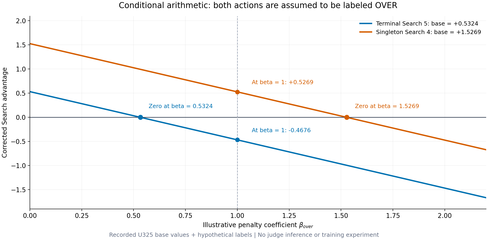
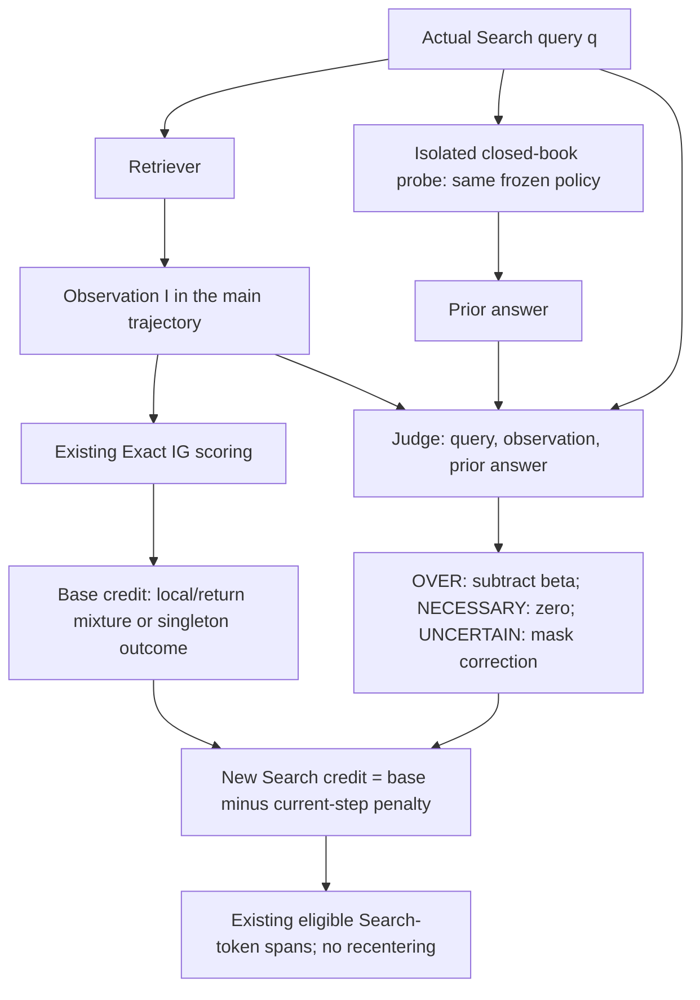

# AetherSearch Over-Search Improvement

**Status: research proposal, documented on 2026-10-03.** This specification
organizes the proposed query-only knowledge probe and its additive Search
credit correction. The production implementation and the historical U325
results use the existing Search-credit rule. This document describes the
proposed improvement; training results and measured gains are pending.

The proposal adds a question that the existing peer-relative retrieval
signals do not directly answer: **can the same policy already answer this
Search query without receiving its retrieved evidence?** A judge compares
that closed-book answer with the query-relevant evidence and identifies
candidate redundant searches. The resulting penalty is applied to the
current Search advantage after the original mixed-credit calculation.

The improvement combines **immediate and future retrieval credit** with a
**current-step over-search penalty**.
“Absolute” describes an **uncentered penalty that does not depend on the
peer-group mean**. It does not mean a perfectly accurate necessity oracle or
a measured Search-versus-stop value difference.

## 1. Preserve the main trajectory; add an isolated scoring branch

The real trajectory continues to use the existing protocol:

```text
<think>...</think>
<search>q_t</search>
<information>I_t</information>
```

For each eligible Search, let $q_{i,t}$ be its actual emitted query and
$I_{i,t}$ the actual retrieved observation. An auxiliary branch asks the
**same policy checkpoint** to answer $q_{i,t}$ without retrieval:

```math
a^{prior}_{i,t}
\sim \pi_{\theta_{old}}\bigl(\cdot\mid P_{probe},q_{i,t}\bigr).
```

$P_{probe}$ is a fixed closed-book instruction. The policy weights are the
frozen rollout-start snapshot, so the probe and rollout refer to the same
policy version. The probe uses a fresh context containing that instruction
and query only: no $I_{i,t}$, earlier observations, trajectory continuation,
final answer, or ground-truth answer. Tool use is disabled. Its text is not
appended to the real trajectory and its tokens receive no actor credit.

This is a **retrospective training-time scoring branch**. Because the judge
uses the actual retrieved observation, it does not prevent that tool call
from occurring during the sampled rollout. Any reduction in later search
usage would be a learned effect that must be measured.

The fixed probe prompt should ask for a concise answer from available
knowledge and permit explicit uncertainty. The prompt version, decoding
configuration, seed, and checkpoint must be recorded. A single successful
answer is evidence of answerability under this probe, rather than proof of
reliable knowledge across repeated samples.

## 2. A three-way, query-level judgment

An external LLM judge receives:

```math
z_{i,t}
=J\bigl(q_{i,t},I_{i,t},a^{prior}_{i,t}\bigr),
\qquad
z_{i,t}\in\{\mathrm{OVER},\mathrm{NECESSARY},\mathrm{UNCERTAIN}\}.
```

The judge evaluates the **key information relevant to the query**, rather
than requiring the closed-book answer to reproduce every retrieved detail.
It should first determine whether the query is sufficiently clear and the
observation contains credible, relevant evidence, then compare factual
coverage, entities, dates, and any contradictions.

| Label | Operational meaning | Additional correction |
|---|---|---|
| `OVER` | The closed-book answer already correctly covers the key query-relevant information supplied by sufficiently clear evidence. | Subtract $\beta_{over}$. |
| `NECESSARY` | The closed-book answer lacks or gets wrong a key fact that the retrieved evidence credibly supplies. This supports a query-level knowledge need. | Zero. |
| `UNCERTAIN` | The query is ambiguous or context-dependent, evidence is insufficient or conflicting, coverage is partial, or correctness cannot be established reliably. | Mask only the new correction. |

`NECESSARY` is an operational label for a knowledge gap filled by the
observation. It is not proof that this exact query was indispensable to the
final answer. Conversely, disagreement with the retrieved text does not
automatically justify `NECESSARY`: the text may itself be wrong or irrelevant.

**No extra necessary-search bonus.** Evidence that the policy needs a fact
does not establish the optimal query, efficient retrieval, or contribution
to the main task. Those aspects remain represented by the existing IG-based
proxy and terminal scoring. IG is itself a proxy, not a complete test of
utility. Giving `NECESSARY` zero correction avoids adding a new positive
bonus that could outweigh weak utility signals.

Keep a validity mask $m^J_{i,t}$ and a separate failure status. Set $m^J=1$
for an accepted `OVER` or `NECESSARY` verdict, and $m^J=0$ for `UNCERTAIN`,
malformed output, probe failure, or judge failure. Define:

```math
o^{over}_{i,t}
=m^J_{i,t}\,\mathbf 1[z_{i,t}=\mathrm{OVER}].
```

The lowercase $o^{over}$ avoids confusion with the existing terminal outcome
$O_i$ used in $Z^O_i$. A masked correction does **not** discard the Search's
valid base credit or remove it from the original peer statistics.

## 3. Preserve the base credit and apply the correction once

For a fixed prompt, the existing Search-credit signals remain:

```math
G^{IG}_{i,t}
=\sum_{\substack{k\ge t\\IG_{i,k}\text{ valid}}}IG_{i,k},
\qquad \gamma=1,
```

```math
A^{loc,IG}_{i,t}
=\frac{IG_{i,t}-\mu_t(IG)}{\sigma_t(IG)+\epsilon},
\qquad
A^{ret,IG}_{i,t}
=\frac{G^{IG}_{i,t}-\mu_t(G^{IG})}{\sigma_t(G^{IG})+\epsilon}.
```

Both statistics use the same prompt and Search depth, population standard
deviation, $\epsilon=10^{-6}$, and the existing zero-variance convention.
The base advantage is:

```math
A^{base}_{i,t}
=\begin{cases}
\tfrac12 A^{loc,IG}_{i,t}+\tfrac12 A^{ret,IG}_{i,t},
&n_{peer}\ge2,\\[4pt]
Z^O_i,&n_{peer}=1.
\end{cases}
```

For an existing policy-eligible, IG-eligible Search, the proposed result is:

```math
\boxed{
A^{search,new}_{i,t}
=A^{base}_{i,t}-\beta_{over}o^{over}_{i,t},
\qquad \beta_{over}\ge0.
}
```

$\beta_{over}$ is a coefficient in **advantage units**, distinct from the
KL coefficient $\beta_{KL}$. It requires calibration; this proposal does not
specify a validated default. The correction is applied once per Search
before expansion to its existing policy-token span.

The specification is limited to existing IG- and policy-eligible Searches.
Unavailable or invalid IG retains the current zero-credit behavior;
policy-ineligible turns remain excluded. Allowing judge-only training on
IG-ineligible turns would be a separate extension of that contract.

### Local correction and future retrieval credit have different roles

The penalty is not inserted into $IG_t$ or its suffix return. For fixed
trajectories, an `OVER` label at Search 3 therefore does not directly subtract
its penalty from Search 1 or Search 2. Their original IG returns remain the
same. This preserves the intended separation between **future retrieval
credit** and **current-action redundancy correction**.

This is a deliberate choice of local advantage shaping, not an assertion
that propagating future search costs is mathematically incorrect. It is also
not an unbiased same-state counterfactual advantage or a policy-invariant
reward transformation. Shared policy parameters still couple learning
across steps.

### Keep the correction outside peer centering

Do not normalize $o^{over}$ within the peer group or recenter the combined
advantage afterward. For a complete non-singleton peer group whose turns
are eligible for correction, the mean base advantage is zero, so:

```math
\overline{A^{search,new}}
=-\beta_{over}\,\overline{o^{over}}.
```

This nonzero group mean is intentional. If the final result were centered
again, it would instead become:

```math
A^{base}_{i,t}
-\beta_{over}\bigl(o^{over}_{i,t}-\overline{o^{over}}\bigr).
```

When every peer is labeled `OVER`, that centering would cancel the entire
correction. Applying the penalty after the original normalization is
therefore part of the method, not just an implementation detail.

## 4. What can be proved from the formula

For fixed base values and accepted labels:

| Property | Exact consequence |
|---|---|
| $\beta_{over}=0$ | Recover the original mixed Search advantage. |
| `NECESSARY`, `UNCERTAIN`, or failed judgment | Keep the base credit; only the new correction is zero. |
| `OVER` | Lower the current Search advantage by exactly $\beta_{over}$. |
| `OVER` with positive base credit | The corrected credit is negative **if and only if** $\beta_{over}>A^{base}_{i,t}$. Equality gives zero. |
| Consecutive singletons with different `OVER` indicators | Their otherwise identical outcome fallback can receive different corrections. |
| All peers labeled `OVER` | Shift the entire advantage group downward by $\beta_{over}$ while preserving its pairwise ranking. |

For a finite group in which every peer is correctly labeled `OVER`, all
corrected advantages are negative when:

```math
\beta_{over}>\max_i A^{base}_{i,t}.
```

These are algebraic properties of the proposal. They do not establish judge
accuracy, overall policy improvement, or a universal choice of penalty
strength. During policy optimization, sign and magnitude affect the
surrogate training signal; clipping, KL, and shared parameters prevent a
guarantee about any individual action probability after an update.

## 5. Apply the reasoning to the two recorded boundary cases

The base values below come from the
[historical U325 case study](search-credit-case-study.md). **Judge labels are
assumed solely to illustrate the formula.** The archived cases have not been
evaluated by the new scoring branch, and neither IG sign nor passage novelty
supplies its missing label. The illustrative coefficients 0.5, 1, and 2 are not tuned
settings or experimental findings.

| Historical case | Recorded $A^{base}$ | Assumed label | New credit, $\beta_{over}=0.5$ | New credit, $\beta_{over}=1$ | New credit, $\beta_{over}=2$ |
|---|---|---|---|---|---|
| Terminal group, trajectory 10, Search 5 | +0.5324 | `OVER` | +0.0324 | −0.4676 | −1.4676 |
| Singleton trajectory 15, Search 4 | +1.5269 | `OVER` | +1.0269 | +0.5269 | −0.4731 |
| Same singleton trajectory, Search 5 | +1.5269 | `NECESSARY` | +1.5269 | +1.5269 | +1.5269 |

*Trajectory 10 and trajectory 15 in this table belong to different prompts.
Values are rounded for display; calculations use the committed full-precision
base values.*

### Singleton: add a step-specific signal without requiring more peers

The fourth singleton Search has $IG=-0.0821$ and $G=1.5723$. The fifth has
$IG=G=1.6544$. Both originally receive $Z^O=+1.5269$.

If the fourth is judged `OVER` and the fifth `NECESSARY`, their credits become
$1.5269-\beta_{over}$ and $1.5269$, respectively. Thus the correction can
distinguish the two actions despite $n_{peer}=1$. The fourth Search does not
have to be terminal for the rule to apply.

The distinction is conditional on the labels. If both steps have the same
$o^{over}$, their credits remain identical. Moreover, $\beta_{over}=1$ still
leaves the fourth Search positive. The proposal adds process-specific
information to the fallback; it does not restore continuous IG-based
differentiation inside the singleton base or guarantee negative credit for
every redundant singleton.

### All-negative terminal peers: counteract positive relative credit

The six-peer terminal group has negative IG for every member, but five
positive base advantages. For trajectory 10:

```math
IG=G=-0.0430355072,
\qquad A^{base}=+0.5323861840.
```

If this Search is judged `OVER`, the correction can make its advantage
negative once $\beta_{over}>0.5323861840$ (shown rounded). With
$\beta_{over}=1$, the corrected value is approximately $-0.4676$.

The largest base advantage in this recorded six-peer group is approximately
$0.7319$. Consequently, **if all six were labeled `OVER`**, a coefficient of
1 would make all six advantages negative. This is conditional arithmetic,
not a measured classification result.

Negative IG alone does not imply `OVER`. A model may lack the relevant fact
while retrieval is distracting, incomplete, or poorly scored. Such a step
can remain `NECESSARY` or `UNCERTAIN`, with its positive relative base credit
unchanged. The correction addresses the overlap between **judge-detected
redundancy** and **positive relative credit**, rather than every possible
negative-IG/positive-advantage case.



*Figure 1. Algebraic illustration, not an experiment: both lines assume an
accepted `OVER` label. Each crosses zero when the penalty equals its recorded
base advantage. The coefficient is varied without rerunning a policy or judge.*

## 6. Relation to delayed credit and the meaning of necessity

The earlier delayed-credit example has $IG=-0.0233$,
$A^{loc}=-0.2705$, $A^{ret}=+2.0107$, and $A^{base}=+0.8701$.
Its strong future return remains inside the base credit. If the new judge returns
`NECESSARY` or `UNCERTAIN`, that credit stays unchanged. If it returns `OVER`,
the result is $0.8701-\beta_{over}$; for an illustrative coefficient of 1 it
is approximately $-0.1299$.

Thus the new proposal deliberately allows a redundancy judgment to outweigh
positive continuation credit. It cannot simultaneously guarantee that every
apparently redundant step is penalized and that every enabling step is
preserved: that tradeoff depends on the reliability and scope of the label.

**Query-only answerability is narrower than trajectory-level necessity.**
The probe does not see the full state $s_t$. A repeated query may seek a fact
already supplied by an earlier observation, while the isolated policy cannot
answer it from parameters alone. The query-only check can then miss redundancy
relative to the actual trajectory history. Conversely, a correct closed-book answer
does not establish that retrieval has no verification, grounding, or
freshness value. Context-dependent query fragments can also make a useful
real Search look unanswerable in isolation.

Because the judge compares a sampled closed-book answer with retrieved
evidence, it is exposed to sampling variation, evidence errors, judge errors,
and query phrasing that reveals or obscures facts. `UNCERTAIN` provides an
abstention path but does not eliminate those sources of error. The proposal
does not estimate:

```math
Q(s_t,\mathrm{Search})-Q(s_t,\mathrm{AnswerNow}).
```

It also supplies no explicit under-search detector for actions that never
invoke retrieval. Both missed redundancy and excessive suppression of useful
search therefore remain relevant evaluation questions.

## 7. Workflow and future implementation contract



The IG node also receives the existing pre- and post-Search contexts. The
diagram shows the additional branch; neither the probe nor the judge writes
back into the main rollout.

The following is specification pseudocode, not a runnable training entrypoint:

```text
1. Freeze the rollout-start policy snapshot and sample the main rollouts.
2. Compute the existing base advantages and eligibility masks.
3. For each eligible Search:
       generate a query-only prior answer with the same frozen policy;
       judge (query, retrieved observation, prior answer);
       validate the label, or mask only the correction on uncertainty/failure;
       corrected_advantage = base_advantage - beta_over * accepted_OVER.
4. Preserve raw IG, raw IG returns, and the original peer statistics.
5. Expand the corrected credit once to the existing Search policy spans.
6. Use the existing policy objective and Answer-credit route;
   do not recenter the corrected Search advantages.
```

An implementation would additionally require judge/probe configuration,
batching, reward-version updates, integration assertions, and failure-handling
tests. At full coverage it adds one policy probe and one judge request per
eligible Search before caching or batching. Caches must account for policy
snapshot, prompts, decoding, query, and the actual judge inputs. These costs
belong in training-efficiency reporting.

Recommended audit fields are the query and observation identity, policy
version, probe response and configuration, judge version, raw label,
abstention/failure status, $A^{base}$, $\beta_{over}$, the applied correction,
and $A^{search,new}$. Existing peer count, IG, suffix return, and novelty
diagnostics should accompany them so the two boundary cases can be audited.

## 8. What still needs experimental validation

The formula supports **conditional correction of the two observed credit
failure modes**. A claim that it fully solves singleton attribution or
terminal over-search would be premature.

Evaluation should compare the existing algorithm with the proposed
correction under matched model, data, rollout budget, and training settings.
Vary $\beta_{over}$ and report answer accuracy/F1, Search count, repeated-query
and no-new-passage rates, compute cost, and multiple-seed uncertainty.
Report judged-label coverage and errors separately for singleton, terminal,
and intermediate steps. Human-reviewed samples or an independent evaluator
should check whether a lower training-judge OVER rate reflects better
behavior rather than adaptation to that judge. Include useful-search
suppression and under-search in the assessment, not only fewer tool calls.

The [conditional calculation script](scripts/build_over_search_illustration.py)
reads the [published historical peer data](data/search-credit-u325-peers.csv)
and generates [illustrative values](data/over-search-conditional-examples.csv)
and PNG/SVG figures. It performs no model or judge inference:

```bash
python docs/scripts/build_over_search_illustration.py
python scripts/validate_readme.py README.md docs/over-search-improvement.md
```
