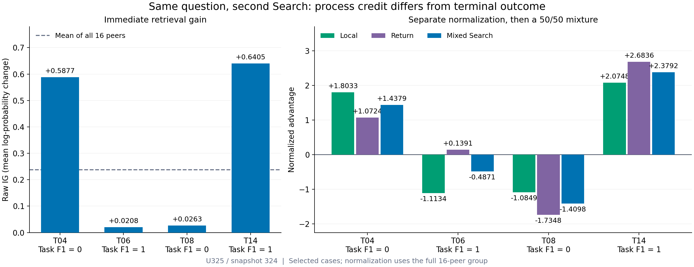
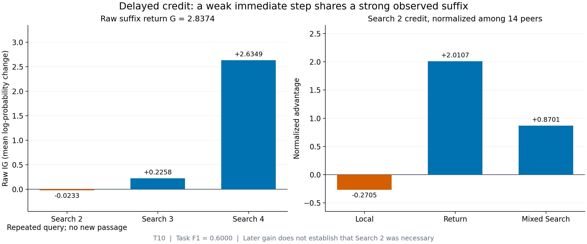
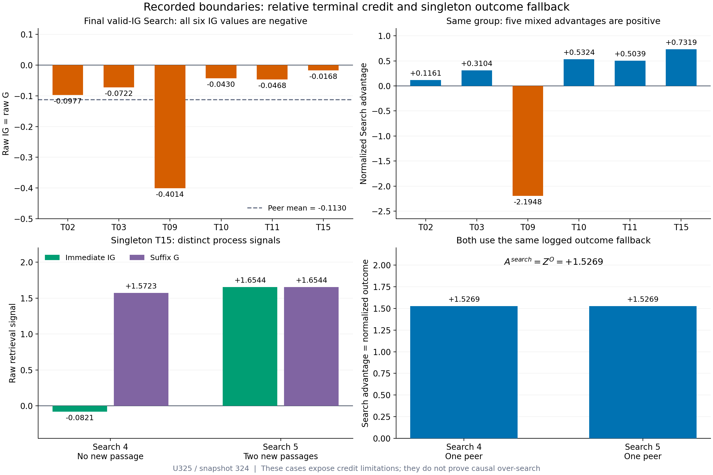

# Search Credit in Real Trajectories: Strengths and Limitations

AetherSearch assigns Search credit using both immediate retrieval gain and
future retrieval return. The recorded cases below show how this mechanism can
reward a productive Search in a trajectory with zero final task reward,
downweight a low-yield repeated Search in a trajectory with full task reward,
and retain credit for a path with weak immediate gain but strong later gain.
They also expose two limitations: terminal-outcome fallback for singleton peer
groups, and positive relative advantages in an all-negative terminal peer group.

**Evidence status.** This is a mechanism case study of selected historical
training trajectories. It supports specific statements about recorded credit
allocation. It does not establish a causal benefit of an individual Search,
an overall reduction in repeated searches, or superiority over another
algorithm. Those claims require controlled evaluations and ablations.

## 1. Evidence and comparison scope

All cases come from successful update **U325**, using rollout, old-policy,
and reward-policy snapshot **324**, recorded on **2026-08-14 at
01:08:56 UTC**. The run identifier is
`formal_resume_u180_to_u500_answer_ragen2_mica_ig_v1_g16_20260813_004642`;
the Search-credit mode is
`answer_only_ragen2_mica_ig_v1_singleton_outcome`.

These historical observations illustrate the credit-assignment rule. They
**do not validate the current state-conditioned v5 retrieval scorer** described
in the [method README](../README.md). No trajectory was rescored for this document.

Each prompt initially has 16 sampled trajectories. At a particular Search
depth, only trajectories with an eligible IG score enter that depth's peer
statistics. Consequently, the cases below have 16, 14, 6, or 1 peers. “Same
depth” means the same ordinal Search action, not equal token length or an
identical observation history. The comparison conditions on the prompt and
Search depth, while the trajectories may have different states and remaining
numbers of searches.

| Case group | Prompt identifier | Search position | Valid peers |
|---|---|---|---|
| Same-depth process differentiation | `hotpotqa:train_46072:125240` | Second | 16 |
| Delayed retrieval credit | `hotpotqa:train_9205:88373` | Second | 14 |
| All-negative terminal retrieval gains | `nq:train_70310:70310` | Fifth | 6 |
| Consecutive singleton fallback | `hotpotqa:train_30199:109367` | Fourth and fifth | 1 at each depth |

Trajectory numbers such as **04** and **10** are local to their prompt; a number
in one case group does not identify the same trajectory in another group.

## 2. What the recorded signals mean

**Terminal task reward.** $R^{task}$ is the alias-aware token-F1 outcome of the
final answer, on a scale from 0 to 1. It is not a binary success flag. A value
of 1 means a full match under the implemented scoring rule; 0 means zero F1;
partial matches can receive intermediate values. The singleton case below
has $R^{task}=0.8$ and the delayed-credit case has $R^{task}=0.6$.
Invalid terminal answers or invalid trajectories are assigned outcome zero
and excluded from terminal-outcome normalization. Search-IG eligibility is
a separate condition: an eligible Search can still belong to a trajectory
with an invalid final answer.

**Immediate retrieval gain.** IG is the recorded change in the scorer's mean
log-probability of the canonical ground-truth answer across the pre- and
post-Search contexts. Positive IG indicates increased answer support under
that scoring proxy; negative IG indicates a decrease. It does not directly
measure causal necessity, factual accuracy, or the number of relevant passages.

**Repeated queries and passage novelty.** Exact query repetition is detected
after Unicode, whitespace, and case normalization. “No new passage” means
that the retrieved passage identities were already seen in that trajectory;
identity uses passage IDs, with a text-hash fallback. These are diagnostic
labels. The mixed-credit branch does not assign its sign directly from either
label. A changed query can retrieve only old passages, and an unseen passage
is not automatically useful. Likewise, no new passage does not establish that
the full model context or its subsequent behavior is unchanged.

**Raw future return.** For valid Search positions in the same trajectory:

```math
G_{i,t}
=\sum_{\substack{k\ge t\\k\text{ has valid IG}}}IG_{i,k},
\qquad \gamma=1.
```

This suffix includes the current Search. Invalid or missing scores are
excluded. $G$ is a raw retrieval return; $A^{ret}$ is its normalized advantage.
They are different quantities.

**Peer-relative advantages.** For the same prompt and Search depth, let
$\mu_t$ and $\sigma_t$ be the population mean and standard deviation of the
relevant signal. With at least two valid peers:

```math
A^{loc}_{i,t}
=\frac{IG_{i,t}-\mu_t(IG)}{\sigma_t(IG)+10^{-6}},
\qquad
A^{ret}_{i,t}
=\frac{G_{i,t}-\mu_t(G)}{\sigma_t(G)+10^{-6}}.
```

The two signals are normalized independently. A signal with population
variance at most $10^{-12}$ contributes exactly zero. Search credit is:

```math
\boxed{
A^{search}_{i,t}
=\frac12 A^{loc}_{i,t}+\frac12 A^{ret}_{i,t}.
}
```

The formula above applies to the non-singleton branch. When there is exactly
one valid peer, the implemented fallback is $A^{search}_{i,t}=Z^O_i$, the
logged within-prompt normalized terminal outcome. The local and return
advantages are not used in that branch. An unavailable or invalid IG score
receives zero Search credit; policy-ineligible actions are excluded from
actor optimization. See the
[credit implementation](../src/agentic_rl/advantage/mica_ig.py) and the
[complete method](../README.md#4-multi-step-search-credit-assignment).

## 3. Strength: differentiate Search credit from the terminal outcome

The four examples below are the **second Search for the same prompt**. Their
advantages use statistics from all **16 peers**, not just the four displayed
trajectories. Values in the narrative are rounded to four decimal places;
the committed data preserve the recorded precision.

| Trajectory | Final $R^{task}$ | Second Search | Immediate IG | $A^{loc}$ | $A^{ret}$ | $A^{search}$ |
|---|---|---|---|---|---|---|
| 04 | 0 | New passages; query not repeated | 0.5877 | +1.8033 | +1.0724 | **+1.4379** |
| 06 | 1 | Repeated query; no new passage | 0.0208 | −1.1134 | +0.1391 | **−0.4871** |
| 08 | 0 | Rewritten query; no new passage | 0.0263 | −1.0849 | −1.7348 | **−1.4098** |
| 14 | 1 | New passages; query not repeated | 0.6405 | +2.0748 | +2.6836 | **+2.3792** |

The full peer-group statistics are:

| Signal | Population mean | Population standard deviation |
|---|---|---|
| Immediate IG | 0.2372184794 | 0.1943613303 |
| Raw suffix return $G$ | 0.4048570186 | 0.3104727267 |



*Figure 1. Raw IG and normalized advantages use separate axes. Four selected
cases are displayed; all 16 peers determine the normalization.*

**Trajectory 04: preserve positive Search credit despite zero final F1.**
The second Search returns new passages and has IG of 0.5877, above the peer
mean of 0.2372. Its suffix return is 0.7378, also above the return mean of
0.4049. Both components are positive, giving $A^{search}=+1.4379$, even
though $R^{task}=0$. A zero-scoring final answer therefore does not erase the
positive retrieval evidence at this intermediate step. This is a concrete
process-credit property; it does not show that the retrieved passages were
sufficient for a correct final answer.

**Trajectory 06: downweight a low-yield repetition despite full final F1.**
The second Search repeats its first query,
`Super Bowl 73 Philadelphia Eagles NFL won 73rd season`, and introduces
no new passage. IG is slightly positive at 0.0208, but substantially below
the peer mean, so $A^{loc}=-1.1134$. Its suffix return of 0.4480 is slightly
above the return mean, yielding $A^{ret}=+0.1391$. The mixture is still
negative: $A^{search}=-0.4871$, although $R^{task}=1$. The observed repeated
Search receives discouraging credit without inheriting the sign of the
successful final outcome. This example supports downweighting this
low-relative-yield repetition, not a general guarantee that every repetition
is discouraged or that its removal would preserve answer quality.

**Trajectory 08: evaluate retrieval yield beyond exact query repetition.**
The second query changes from
`Super Bowl 73 Philadelphia Eagles NFL won 73rd season` to
`73 Philadelphia Eagles NFL won 73rd season Super Bowl`. It is not an exact
repeat under the diagnostic, but retrieves no new passage. Immediate IG is
only 0.0263, and the suffix return is −0.1337. Both normalized components
are negative, giving $A^{search}=-1.4098$. Thus, a surface rewrite does not
automatically obtain positive credit: the recorded retrieval signals still
identify a weak step and suffix.

**Trajectory 14: reinforce a step with strong immediate and future signals.**
The second Search returns new passages, with IG of 0.6405 and suffix return
of 1.2380. Both exceed their respective peer means, producing
$A^{loc}=+2.0748$, $A^{ret}=+2.6836$, and $A^{search}=+2.3792$.
The final task reward is also 1. This case shows that strong process credit
can align with a full-scoring final answer, while trajectories 04 and 06
show that such alignment is not required.

**Supported advantage.** In the non-singleton branch, the mechanism evaluates
immediate and future retrieval signals separately from direct terminal-outcome
credit. These cases exhibit finer Search-level differentiation than assigning
every Search the same terminal-outcome advantage. The comparison is
prompt-and-depth relative; it is not a matched-state estimate of the marginal
value of searching rather than answering immediately.

## 4. Strength and tradeoff: preserve credit for a strong continuation

For prompt `hotpotqa:train_9205:88373`, trajectory **10** repeats its first
query on the second Search:
`helicopter crash take killed Vic Morrow location`. No new passage is
recorded. The subsequent queries are `California location` and
`Indian Dunes Vic Morrow helicopter crash take killed location`.

| Search | Immediate IG | Recorded observation |
|---|---|---|
| Second | −0.0233 | Repeated query; no new passage |
| Third | +0.2258 | Later retrieval gain |
| Fourth | +2.6349 | Larger later retrieval gain |

At the second Search, the full-precision suffix sum gives:

```math
G_{10,2}=2.8373752609.
```

After independent normalization among **14 peers**:

```math
A^{loc}_{10,2}=-0.2705,
\qquad
A^{ret}_{10,2}=+2.0107,
\qquad
A^{search}_{10,2}=+0.8701.
```



*Figure 2. The raw suffix return is 2.8374; its normalized return advantage
is 2.0107. The final task F1 of this trajectory is 0.6.*

The local component records that this Search is weak relative to its peers.
The return component records that the observed continuation accumulates
strong retrieval gain. Their mixture preserves positive credit for that
continuation instead of determining Search credit solely from the current IG.
This is the intended delayed-credit behavior: an intermediate Search may
affect later queries or reasoning even when its immediate scoring gain is
small.

**The causal limit matters for this particular example.** The repeated step
has no newly identified passage and negative IG. The logs establish that
large gains occurred later; they do not establish that this step caused
those gains, contributed useful new information, or was necessary for the
eventual answer. A removable repetition could also share the same later
return. Establishing its marginal contribution would require a controlled
skip-step comparison. The example therefore illustrates the intended
continuation credit and its attribution tradeoff, rather than proving the
repetition itself was beneficial.

## 5. Limitations exposed by actual trajectories

### 5.1 Consecutive singleton steps inherit identical outcome credit

For prompt `hotpotqa:train_30199:109367`, trajectory **15** has five valid
Searches. Only this trajectory remains an eligible peer at the fourth and
fifth Search depths. Its final task reward is 0.8 and its logged normalized
terminal outcome is $Z^O=+1.5269$.

| Search | Valid peers | Immediate IG | Raw suffix $G$ | New passages | Actual $A^{search}$ |
|---|---|---|---|---|---|
| Fourth | 1 | −0.0821 | +1.5723 | None | **+1.5269** |
| Fifth | 1 | +1.6544 | +1.6544 | Two | **+1.5269** |

The fourth Search is **not the last Search**:

```math
G_{15,4}=-0.0821137428+1.6543675363=1.5722537935.
```

Nevertheless, its positive credit comes from the singleton fallback,
$A^{search}=Z^O$, rather than from mixing this suffix with its immediate IG.
The recorded local and return advantage fields are absent for both singleton
steps. They must not be interpreted as ordinary zero-valued components.

The fourth step has negative IG and no new passage; the fifth has a large
positive IG and two new passages. Assigning both the same terminal-outcome
credit loses this distinction. A trajectory that continues searching after
its peers stop can inherit the same positive outcome credit across multiple
singleton positions. The issue follows from unequal trajectory lengths and
peer availability; it is not specific to long individual sentences.

This exposes a limitation in process-specific attribution. It does not
establish that both steps are excessive: the fifth step has a strong positive
retrieval signal, and the necessity of the fourth is unresolved. Improving
credit allocation under sparse peers remains a research question.

### 5.2 An all-negative final peer group can yield positive advantages

For prompt `nq:train_70310:70310`, the fifth Search has **six valid peers**.
It is the last Search with a valid IG score in each trajectory, so the entire
peer vectors satisfy $G=IG$. Some trajectories attempt a later Search whose
score is unavailable; those attempts do not contribute to the valid suffix.

| Trajectory | Final valid-IG Search: $IG=G$ | Actual $A^{search}$ |
|---|---|---|
| 02 | −0.0977 | +0.1161 |
| 03 | −0.0722 | +0.3104 |
| 09 | −0.4014 | −2.1948 |
| 10 | −0.0430 | **+0.5324** |
| 11 | −0.0468 | +0.5039 |
| 15 | −0.0168 | +0.7319 |

All six immediate gains are negative, but **five Search advantages are
positive**. The population statistics are
$\mu(IG)=-0.1129971743$ and $\sigma(IG)=0.1314105001$. For trajectory 10:

```math
A^{loc}=A^{ret}=A^{search}
=\frac{-0.0430355072-(-0.1129971743)}{0.1314105001+10^{-6}}
=+0.5323861840.
```

This is the expected result of centering on a negative peer mean, not a
numerical error and not the singleton fallback. The positive sign says
“better than this peer-group mean”; it does not say that the Search increased
the scorer's absolute answer support. In this example, trajectory 10 also
has a repeated query, no new passage, and zero final task F1.

Here the return component adds no distinct future signal because both
complete peer vectors are identical. Relative ranking therefore cannot
establish whether another Search was preferable to stopping and answering.
The question of credit for terminal steps with uniformly weak retrieval
gains remains open.



*Figure 3. Top: six negative raw gains and their relative advantages. Bottom:
different singleton process signals and the identical outcome fallback.
Each panel uses the units indicated on its own axis.*

## 6. What these examples justify

| Statement | Evidence supported by these cases |
|---|---|
| Search credit can distinguish process signals from the final task outcome. | Yes: trajectory 04 has zero final F1 and positive Search credit; trajectory 06 has full final F1 and negative Search credit. |
| A low-yield repetition can receive negative credit despite a full-scoring answer. | Yes: trajectory 06 at the second Search. |
| A query rewrite is not enough to obtain positive Search credit. | Yes: trajectory 08 retrieves no new passage and receives negative credit. |
| The mixed design can preserve credit for a weak current step followed by strong gains. | Yes: the delayed-return trajectory 10. |
| That repeated step was necessary for the later gains or final answer. | Not established without a counterfactual comparison. |
| The method always suppresses repetitions or prevents over-search. | Not established; delayed return, singleton fallback, and terminal relative ranking expose contrary credit cases. |
| The 50/50 mixture is optimal or outperforms alternative credit rules. | Not established without ablations and controlled performance measurements. |

The documented strength is **Search-level, prompt-and-depth-relative
credit differentiation with both immediate and continuation signals**.
The documented limitations concern **causal attribution of shared future
returns, loss of process specificity in singleton fallback, and the absence
of an absolute stopping reference in terminal peer-relative normalization**.
Their effects on answer quality, search cost, and repetition frequency need
further empirical study. This case study leaves optimization of these
boundaries to future research.

## 7. Data and figure reproducibility

The public evidence includes:

- [Complete peer-group data](data/search-credit-u325-peers.csv): 38 rows covering
  all members of the five prompt-depth groups, including both singleton depths.
- [Trajectory evidence and provenance](data/search-credit-u325-trajectories.json):
  37 trajectory records with queries, terminal outcomes, valid and invalid
  Search positions, passage-identity diagnostics, and full-precision IG values.
- [Verification and figure builder](scripts/build_search_credit_figures.py):
  recomputes population statistics, suffix returns, the mixed advantages, and
  the fallback equality from the committed evidence before rendering figures.

The terminal outcome $Z^O$ is preserved as a logged value; the script verifies
its use in the fallback, rather than reconstructing outcome normalization
from these selected trajectory records. The evidence is a selected excerpt,
not the full training corpus or an independent rerun of the retrieval scorer.

With NumPy and Matplotlib available, run from the repository root:

```bash
python docs/scripts/build_search_credit_figures.py
python scripts/validate_readme.py README.md docs/search-credit-case-study.md assets/README.md
```

The figures are committed as both PNG and SVG under `assets/figures/`.
The builder verifies every peer row at full precision with an absolute
tolerance of $10^{-10}$; displayed four-decimal values are not used to
recompute the advantages.
